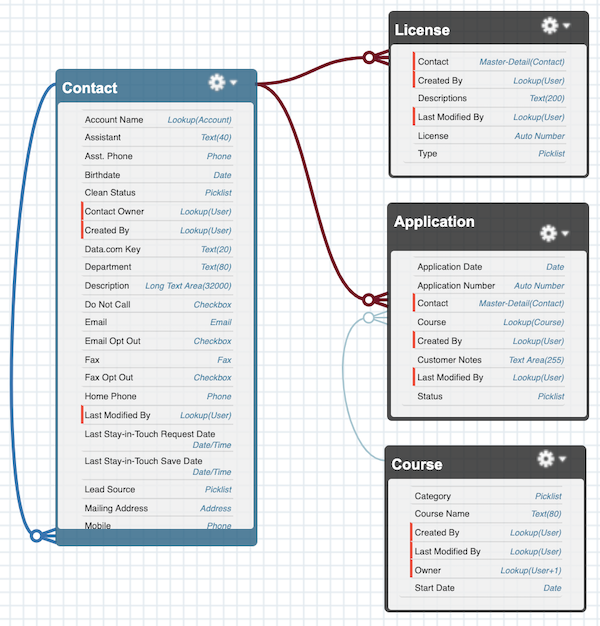

# flowApp

A basic Salesforce object schema with trivial fields and a sample data set for use in scratch orgs.  Just a simple time-saving package when trying out new ideas.

Use this project as a basic proof of concept development model.  Work out your ideas without having to instantiate a new schema or use existing org models.  A quick way to spin up a test/dev environment.

Includes sample dataset.  

## Purpose & Intent

1. Have a deployable and generic sfdx project for creating course applications through Lightning Flow.  However it can be used for any purpose you see fit.

2. Training use, not intended for business deployment.  This is a "learning" package for those of us getting used to new Lightning features but frequently work outside the standard Salesforce object model.

## Prerequisites

Salesfore DX environment.

## Current Status

Basic objects, tab and fields created.  A permission set is included, and sample Account->Contact dataset is avaiable in sampleData directory.



## Future State / Next steps

[X] Create generic account / contact dataset
  
[ ] Create generic course records

[ ] Create (branch) flows for course application and registration.

[ ] Implement flow interviews as lightning components within Communities.

## How to use

Simply depoy this sfdx project to a fresh scratch org, assign the permission set to your profile, then start building your flow(s).  No external packages or other data models required.  

1. Create a scratch org

    `sfdx force:org:create -s -f config/project-scratch-def.json -a flowApp`

2. Push source

    `sfdx force:source:push -u flowApp`

3. Assign the permission set

    `sfdx force:user:permset:assign --permsetname Application_Flow`

4. Import sample data if desired

    The sample data set assumes a standard Salesforce Account - > Contact setup.  If using a Person Account or HEDA model, you will need to use a different sample data set.

    `sfdx force:data:tree:import -p sampleData/Account-Contact-plan.json -u flowApp`

## Alternative Install Script

The following script will allow you to name the scratch org whatever you want.  Copy and paste the following block in your terminal.  Then execute the script from the root of the project directory by simply typing `flowApp <Alias to assign to the org>`

```bash
alias flowApp='function sproject() {
    sfdx force:org:create -a $1 -f config/project-scratch-def.json && \
    sfdx force:user:password:generate -u $1 && \
    sfdx force:source:push -u $1 && \
    sfdx force:user:permset:assign --permsetname Application_Flow -u $1 && \
    sfdx force:data:tree:import --plan sampleData/Account-Contact-plan.json -u $1 && \
    echo "Success"};sproject'
```

Example: The following will create a scratch org named "TestScratchOrg" and related data:  `flowApp TestScratchOrg`
